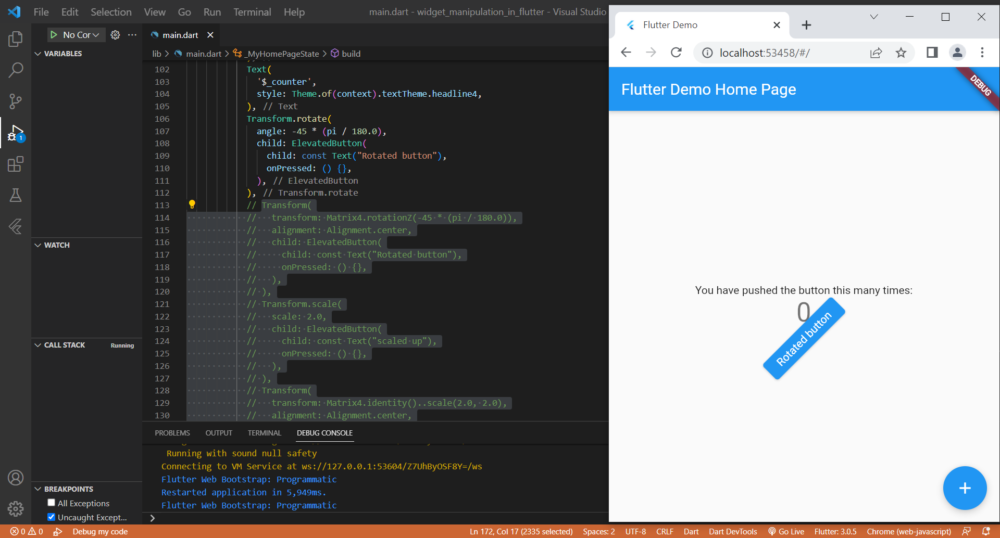
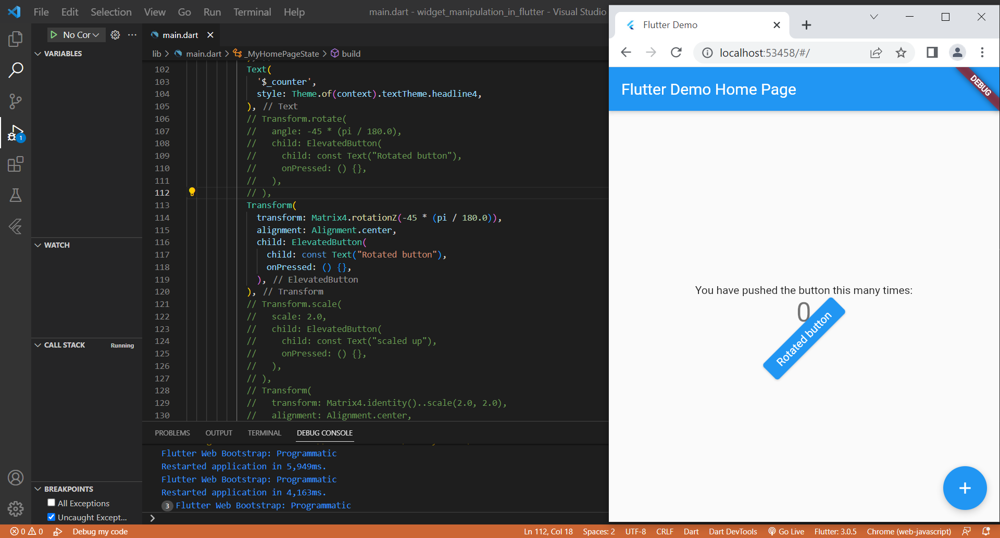
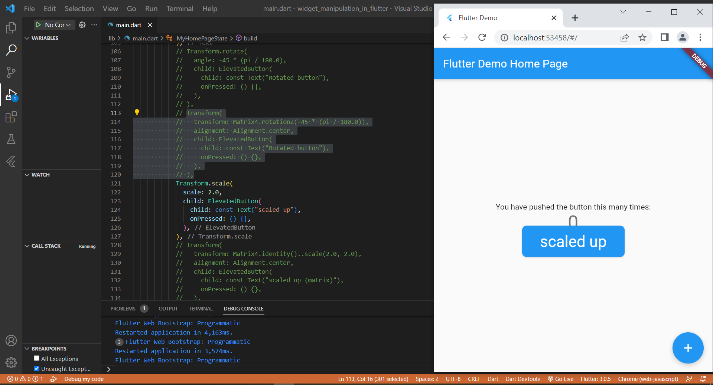
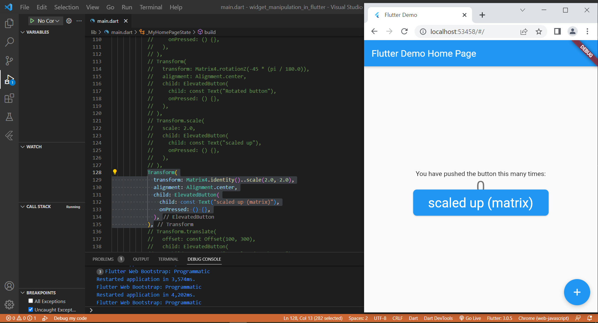
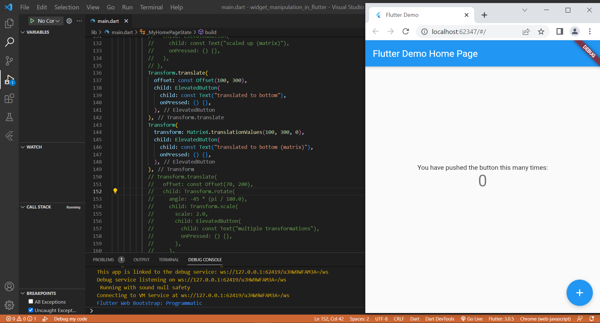
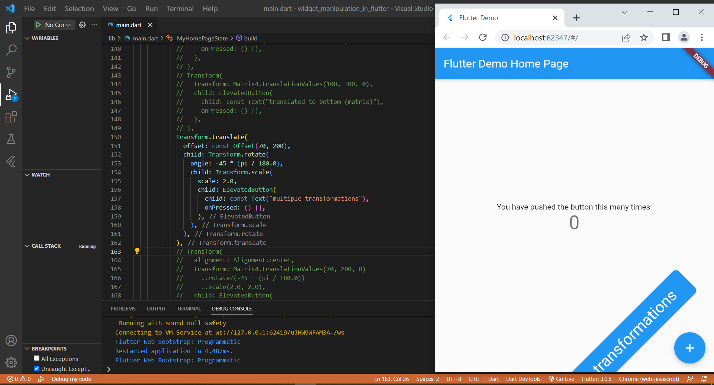
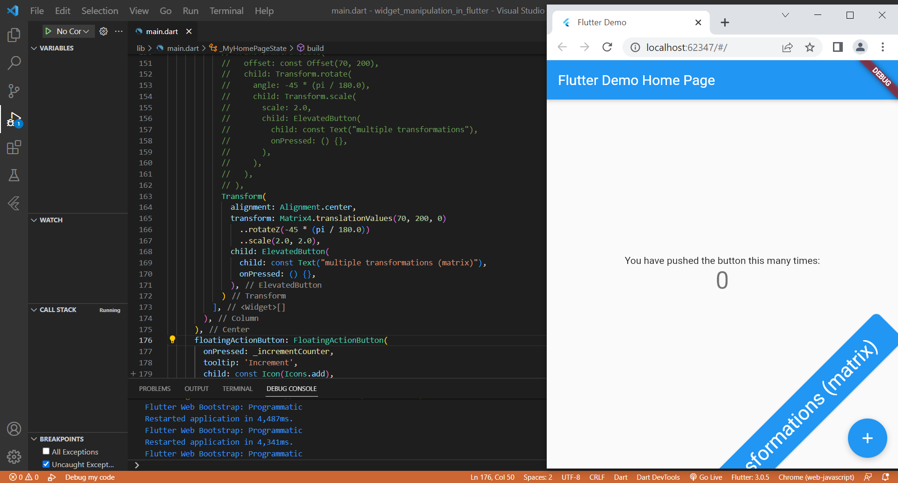
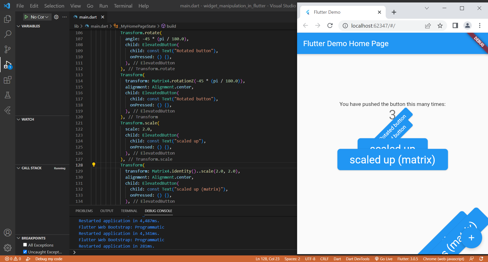
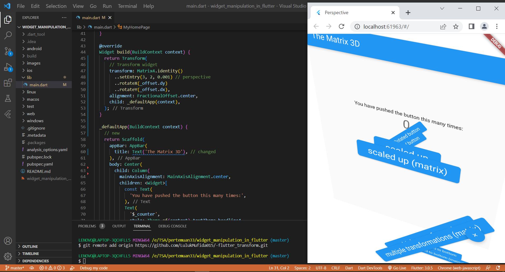

# widget_manipulation_in_flutter

TSA Pertemuan 33 - Manipulasi Widget

## Latihan Praktikum

Pada latihan praktikum ini saya menerapkan beberapa transform yang harus import library math untuk melakukan perhitungan angka yakni :

1. Transform rotation tanpa menggunakan matrix4

2. Transform rotation menggunakan matrix4

3. Transform scale tanpa menggunakan matrix4

4. Transform scale menggunakan matrix4

5. Transform translate tanpa dan menggunakan matrix4

6. Transform transformations tanpa menggunakan matrix4

7. Transform transformations menggunakan matrix4

8. Berikut adalah hasil keseluruhannya

## Tugas Praktikum 1

Pada tugas praktikum 1 saya membuat perspective sesuai dengan referensi yang diberikan pada materi hari ini. Untuk membangun aplikasi tersebut terdapat 2 hal yang harus diterapkan yakni transform dan GestureDetector

1. Langkah pertama menambahkan transform

2. Langkah kedua menambahkan GestureDetector

## Tugas Praktikum 2

Pada tugas praktikum 2 saya membuat flip panel yakni menunjukkan tanggal hari ini

